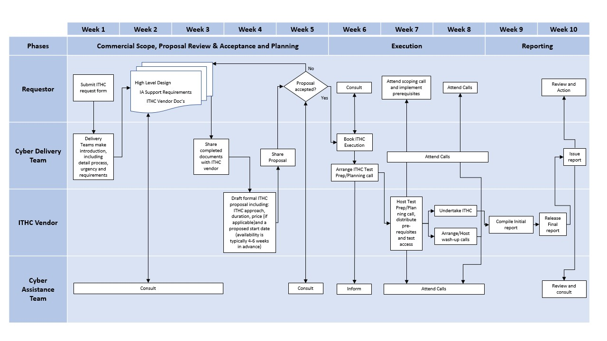

# What is an IT Health Check, and why is it important?

An IT Health Check \(ITHC\), also known as a Penetration \(Pen\) Test, is a series of controlled ethical hacking tests and actions, designed to identify and exploit security vulnerabilities in networks and applications.

The testing output reports any vulnerabilities identified, and provides the opportunity to mitigate the findings before the services are made available for wider consumption \('go live'\).

Once services are Live, it is recommended that ITHC's are performed at least annually to assure and maintain the integrity of the security baseline. If the existing baseline does not take into consideration emerging and evolving technologies, over time this introduces and widens the gap of opportunity for vulnerabilities to become exposed, and therefore compromises IT security health.

## What can be tested?

The ITHC is performed by highly trained pen testing specialists, and \(typically\) by an external \(3rd party\) ITHC service provider.

There are many types of penetration tests that can be applied, including but not limited to:

-   Network and host configuration.

-   Web application.

-   Wireless network.

-   Client-server application.

-   End User devices such as laptops or mobile phones.

-   Social engineering.

-   Build configuration.

## Vulnerability Scanning

A vulnerability scan is different from an ITHC. A vulnerability scan is automated, and is entirely software-based, whereas an ITHC is conducted by trained, qualified professionals, and uses human interaction and human ingenuity to discover flaws that automated tools often miss.

## How can I book an ITHC?

If you have a requirement to conduct an ITHC on your network or application, please complete and submit the New ITHC Request form:

[New ITHC Request Form](https://forms.office.com/Pages/ResponsePage.aspx?id=KEeHxuZx_kGp4S6MNndq2DJZ0qLuxaVBtuHXfXAIqUZUNDZTMTZJVjJZUkhLUFFLSEdOQ0lWOEUyWCQlQCN0PWcu)

As well as registering your request, this initiates engagement with the Security, Services and Information Governance Group, who will further facilitate and manage the engagement and planning logistics between yourself and the 3rd party ITHC Team. It is advised that your project has a Cyber Assistance Team Consultant engaged to assist during the ITHC.

You can contact the CAT Team directly to request Consultant support if one isn't already working with your project:

[CyberConsultancy@digital.justice.gov.uk](mailto:CyberConsultancy@digital.justice.gov.uk)

# Governance Workflow and Timeline considerations

## Timeline Consideration

It is recommended that an approximate timeline of 8 weeks is considered in your project plan to enable the planning and undertaking of the ITHC. Maturity, size, and complexity of the scope will influence this.

## Scope Changes

Changes to scope can be reviewed and considered. However, there is a risk that this will affect delivery dates, ITHC Provider availability, and end quote price. It is strongly recommended that ITHC scope is understood and confirmed as much as possible, and prior to submission.

An overview of the ITHC Workflow is provided as a [download](../downloads/ITHC%20workflow%20process.pptx), and can be seen in the following diagram:

